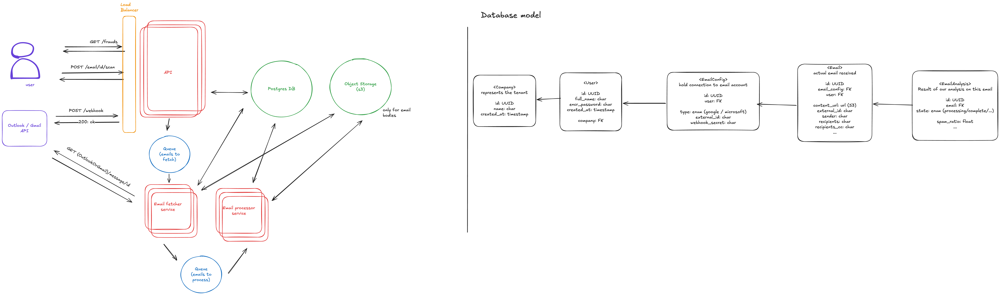

# Stoic Challenge

## Table of Contents

- [Regarding the codebase](#regarding-the-codebase)
- [Architecture Design](#architecture-design)
- [Email fraud detection](#email-fraud-detection)

# Regarding the codebase

I implemented a simple API where the user can input its email provider credentials and synchronise their email in the internal database. The main endpoints are

- GET /emails to list emails
- POST /email-configuration/google to setup the google email connection. This starts an oauth flow.
- POST /emails/sync to synchronize the emails

The API uses a JWT auth scheme following the OAuth 2 standard.

The PostgreSQL database is managed using sqlalchemy and alembic (for migrations)

## Notes

- The db schema has been simplified compared to my design below to support only this feature.
- Tests run in the CI on each commit

## Next steps

- Currently, only google emails are supported but the system with conceived to easily expand to any email provider.
- Only triggered sync is implemented for now. Webhook support could be added to add handle new emails in real-time
- All operations happen within the web server workers, which slow down response time. Heavy operation like syncing emails could be done in a background task with a celery worker.
- Implement actual fraud detection on the emails.

# Architecture Design

Setting aside the code, my design handle the full fraud detection system and can support up to 10M email per day.

## Workers

### Web server

The server handles http request which includes mostly

- GET /emails - get the email of the current user along with their fraud reports
- POST /emails/id/scan - trigger ad hoc scan on an existing email to refresh its report
- POST /webhook/{service} - to get real-time emails from email provider (google, microsoft…)

New server can be spinned up depending on metrics like request per second, idle server number. This is combined to a load balancer that can spread the load on these servers

### Email fetcher

when an email event is received, the event might not contain all the email metadata and its content. We need to fetch its content to save it to our blob storage. This is done by dedicated workers.

### Email processor

After the email is fetch we can actually process it, ie apply our rules for fraud detection. This services fetches the data from our own storage (pg db for the metadata, s3 bucket for the content) and apply the scanners on it.

## Storage

### Postgres DB

The database hold all the relation data

- users
- user email configuration
- emails
- email scans

We can horizontally spread by having multiple databases and separate our data based on our tenants. We could have our first 1000 clients in DB 1, then DB 2 etc… This ensures us that we can grow indefinitely.

### Blob storage

A blob storage is needed to hold the email content. This should not go in the pg db as this data can grow and bloat the relational database. Also, it scales really well without performance impact. It is fine to store the content as a blob as we don’t need to index email content, we simply need to fetch it.

## Queues

We need 2 different queues:

1. hold the email references that needs to be fetched and persisted in our storages
2. hold the email references that needs to be scanned.

Dead letter queues can be added parallely to handle failed operation and inspect the messages by hand.

# Email fraud detection

How can we actually do fraud detection?

Each email should be attributed a score from 0 to 1. 0 = no fraud, 1 = 100% guarantee fraud.

Some rules could be applied parallely and contribute ponderally to the score.

## Domain matching

check if the displayed name matches the domain

## Domain quality

check the domain reputation using external API

- domain age
- misspelled domains

## Header check

check the DMARC, SPF and DKIM headers

## Content scanning

- Use NLP to analyse if the email matches popular scam attempts:
  - Ask for personal contact details
  - Demand from important person with urgency
  - The user won a gift
- Use LLM directly to analyse the content and determine if there is a risk
  - This is more costly
  - This could be used conditionally if the computed score is too ambiguous
